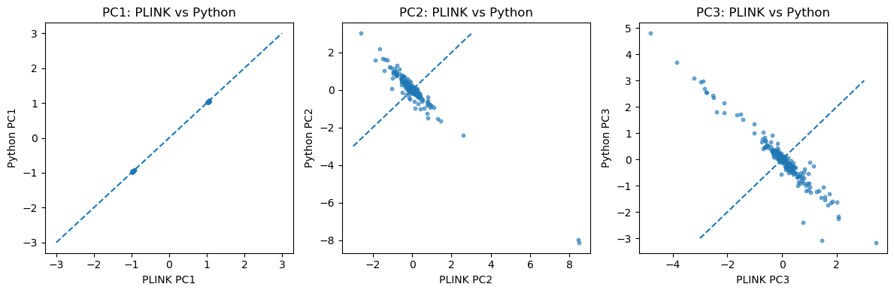
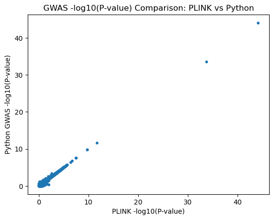
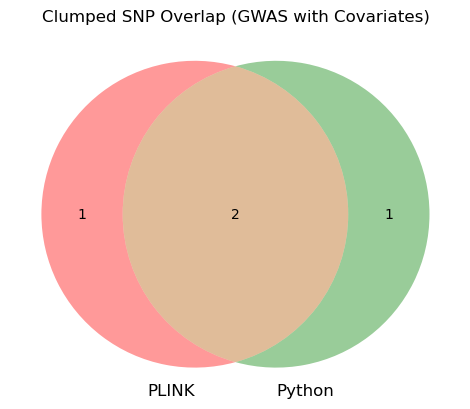

# CSE-284-GWAS
This CSE 284 project reimplements PLINK's `--pca`, `--linear`, and `--clump` commands from scratch in Python, reproducing a complete GWAS pipeline. At a high-level, our implementation of each command does the following:

1. `--pca` computes principal principal components by standardizing the genotype matrix, constructing a genetic relationship matrix (GRM), and performing eigendecomposition to obtain components that capture population structure such as ancestry.

2. `--linear` (GWAS) computes P-values and effect sizes by residualizing the phenotype and genotype data on covariates, then performing per-SNP linear regression.

3. `--clump` identifies independent lead SNPs by filtering SNPs by P-value threshold, selecting the most significant SNP as the lead, and grouping nearby SNPs within a defined genomic window and LD threshold.

## Requirements
This was tested on **Python 3.14.3**.

### Dependencies
The following Python libraries are required:

- cyvcf2
- numpy
- pandas
- matplotlib
- scikit-learn
- scipy
- qqman

### Installation
Install all dependencies using:

```bash
pip install -r requirements.txt
```

## Usage
Below is a description of each of our implemented command's usage, available flags, outputs, and an example.

### PCA (`pca.py`)
```bash
python pca.py --vcf <vcf_file> --out <output_prefix> [options]
```

| Argument | Required | Default | Description |
|---|---|---|---|
| `--vcf` | Yes | — | Path to input VCF file |
| `--out` | Yes | — | Output file prefix |
| `--num_pcs` | No | all | Number of principal components to compute |

Outputs `<out>.eigenvec` and `<out>.eigenval`.

**Example** (run from root of project):
```bash
python scripts/PCA.py \
    --num_pcs 3 \
    --vcf data/ps3_gwas.vcf.gz \
    --out python_results/pca
```


### GWAS (`gwas.py`)
```bash
python gwas.py --vcf <vcf_file> --phen <phenotype_file> --out <output_prefix> [options]
```

| Argument | Required | Default | Description |
|---|---|---|---|
| `--vcf` | Yes | — | Path to input VCF file |
| `--phen` | Yes | — | Path to phenotype file (FID, IID, PHEN) |
| `--out` | Yes | — | Output file prefix |
| `--covar` | No | `false` | Include PC covariates in regression (flag) |
| `--pcs` | Yes if --covar flag| — | Path to eigenvec/PC file (*required if `--covar`) |
| `--maf` | No | `0.01` | Minor allele frequency threshold |

Output is written to `<out>.assoc.linear`.

**Example** (run from root of project):
```bash
python scripts/GWAS.py \
    --vcf data/ps3_gwas.vcf.gz \
    --phen data/ps3_gwas.phen \
    --pcs plink_results/ps3_gwas.eigenvec \
    --covar \
    --maf 0.05 \
    --out python_results/gwas_covar
```

### Clump (`clumping.py`)

```bash
python clump.py --clump <gwas_file> --vcf <vcf_file> --out <output_prefix> [options]
```

| Argument | Required | Default | Description |
|---|---|---|---|
| `--clump` | Yes | — | Path to GWAS summary statistics file |
| `--vcf` | Yes | — | Path to VCF file used in the GWAS |
| `--out` | Yes | — | Output file prefix |
| `--p1` | No | `1e-4` | P-value threshold for index (lead) SNPs |
| `--p2` | No | `0.01` | P-value threshold for clump member SNPs |
| `--kb-window` | No | `250` | Window size in kilobases |
| `--r2` | No | `0.5` | LD r² threshold |

Output is written to `<out>.clumped`.

**Example** (run from root of project):
```bash
python scripts/clumping.py \
    --clump plink_results/ps3_gwas_covar.assoc.linear \
    --vcf data/ps3_gwas.vcf.gz \
    --p1 5e-8 \
    --out python_results/gwas_covar
```

## Comparison Against PLINK
To evaluate our implementation, we ran equivalent commands in both our scripts and PLINK and compared the results in `results/results.ipynb`. The exact commands we ran are listed in `results/commands.txt` for transparency.

To run the notebook yourself, you will need to copy `ps3_gwas_covar.assoc.linear` and `ps3_gwas.assoc.linear` from `public/ps3` on DataHub into the `plink_results/` directory. These files are excluded from the repository due to GitHub file size limits.

### PLINK PCA vs. Our PCA
The top 3 PCs show strong correlation with PLINK's output (PC1: ~1.0, PC2: ~-0.977, PC3: ~0.970). The high magnitude correlations confirm our method produces equivalent results. The negative signs are expected, as eigenvector sign is arbitrary.



### PLINK GWAS vs. Our GWAS
Here we compare GWAS results with PC covariates included. Results without covariates were consistent as well but are omitted for brevity (see `results/results.ipynb`).

The Manhattan and QQ plots match PLINK's output closely:


Effect sizes show a correlation of ~1 with PLINK's output:


P-values show a correlation of ~0.999:



### PLINK Clumping vs. Our Clumping
Comparing clumping results, both methods identify 3 lead SNPs with 2 overlapping. Upon further inspection, the one differing lead SNP in PLINK's output falls within the clump of our corresponding lead SNP, indicating the two methods identify the same underlying signal.



## File Structure

```
CSE-284-GWAS/
├── README.md
├── requirements.txt
├── data/
│   ├── ps3_gwas.vcf.gz               # Input genotype data (VCF format)
│   ├── ps3_gwas_deduped.vcf.gz       # Deduplicated VCF (used for clumping)
│   └── ps3_gwas.phen                 # Simulated phenotype file
├── scripts/
│   ├── PCA.py                        # PCA implementation
│   ├── gwas.py                       # GWAS association testing (linear regression)
│   └── clumping.py                   # LD clumping implementation
├── notebooks/
│   ├── PCA.ipynb                     # PCA development notebook
│   ├── gwas.ipynb                    # GWAS development notebook
│   └── clumping.ipynb                # Clumping development notebook
├── results/
│   ├── results.ipynb                 # Comparison and visualization notebook
│   └── commands.txt                  # Exact PLINK commands used for comparison
├── graph_results/
│   ├── pca.png                       # PCA correlation plot (PLINK vs. ours)
│   ├── plink_gwas.png                # PLINK Manhattan/QQ plots
│   ├── python_gwas.png               # Our Manhattan/QQ plots
│   ├── effect_size.png               # Effect size correlation plot
│   ├── pval.png                      # P-value correlation plot
│   └── clump.png                     # Clumping comparison plot
├── python_results/
│   ├── pca.eigenval                  # Our PCA eigenvalues
│   ├── pca.eigenvec                  # Our PCA eigenvectors
│   ├── gwas.assoc.linear             # Our GWAS results (no covariates)
│   ├── gwas_covar.assoc.linear       # Our GWAS results (with PC covariates)
│   ├── gwas.clumped                  # Our clumping results (no covariates)
│   └── gwas_covar.clumped            # Our clumping results (with PC covariates)
└── plink_results/
    ├── ps3_gwas.eigenval             # PLINK PCA eigenvalues
    ├── ps3_gwas.eigenvec             # PLINK PCA eigenvectors
    ├── ps3_gwas.assoc.linear         # PLINK GWAS results (no covariates)
    ├── ps3_gwas_covar.assoc.linear   # PLINK GWAS results (with covariates)
    ├── ps3_gwas_clump.clumped        # PLINK clumping results (no covariates)
    └── ps3_gwas_covar_clump.clumped  # PLINK clumping results (with covariates)
```