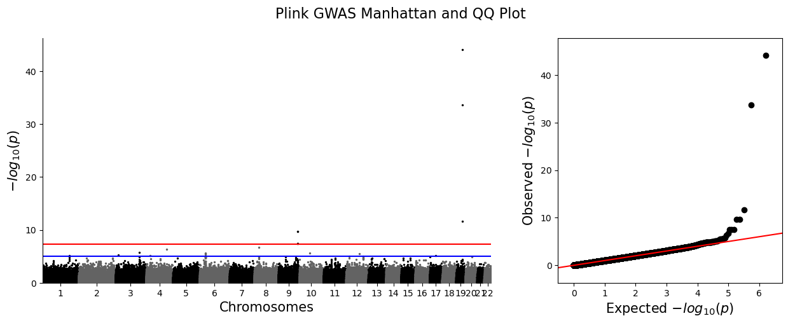
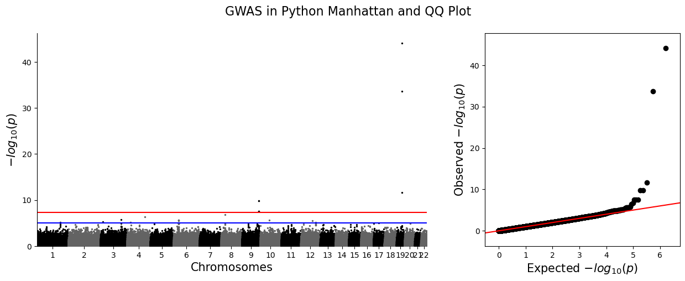
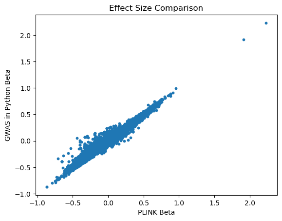
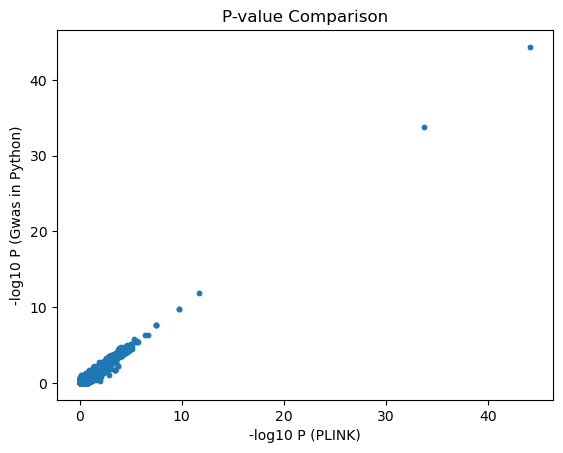

# CSE-284-GWAS
This is a project for CSE 284 Personal Genomics for Bioinformaticians. It implements a Genome-Wide Association Study (GWAS) pipeline from scratch in Python, performing single-variant association testing where each SNP is independently tested for association with a quantitative phenotype (e.g. height, BMI, weight) using linear regression. The pipeline covers the full workflow from raw genotype data (VCF format) through computing principal components via SVD and using them as covariates, with results visualized via QQ and Manhattan plots and validated against PLINK using 1000 Genomes data and simulated phenotypes.

## Requirements
This project requires **Python 3.8 or higher**.

### Dependencies
The following Python libraries are required:

- cyvcf2
- numpy
- pandas
- matplotlib
- scikit-learn
- scipy
- qqman

### Installation
Install all dependencies using:

```bash
pip install -r requirements.txt
```


## Usage
1. Place the `ps3_gwas_covar.assoc.linear` and `ps3_gwas.assoc.linear` files from `public/ps3` on DataHub into the `plink_results/` directory. These files were not included in the repository due to GitHub file size limitations.

2. Run the notebooks in the following order:

- `src/PCA.ipynb` – performs PCA to estimate population structure  
- `src/gwas.ipynb` – runs GWAS association tests  
- `src/results.ipynb` – generates result summaries and plots

Running these notebooks sequentially performs the full GWAS analysis, generates visualizations (e.g., Manhattan and QQ plots), and compares the results to those produced by PLINK.

## Source File Descriptions
### `src/PCA.ipynb`
Computes the top 3 principal components (PCs) from the VCF genotype data to capture population structure. Reads all SNPs into a genotype matrix, imputes missing values with per-SNP means, standardizes, and runs truncated SVD. Signs are flipped for consistency, and the resulting eigenvectors are written to `python_results/eigenvec.txt`. A correlation check against PLINK's PCA output validates the result (~0.9999 correlation).

### `src/gwas.ipynb`
Runs two rounds of GWAS using simple linear regression:
1. **Without covariates** – regresses each SNP's dosage against the phenotype directly (OLS), writing results to `python_results/gwas_results.tsv`.
2. **With PC covariates** – projects out the effect of the top 3 PCs from both the phenotype and genotype before regression (partial regression), writing results to `python_results/gwas_results_covar.tsv`.

Both runs filter SNPs with MAF < 1% and report effect size (beta), p-value, and sample size per SNP.

### `src/results.ipynb`
Compares the Python GWAS results to PLINK's output. For both the no-covariate and covariate runs, it generates side-by-side Manhattan and QQ plots, scatter plots of effect sizes and p-values, and computes beta correlations and top-SNP overlap between Python and PLINK. The covariate-adjusted run achieves 10/10 top-SNP overlap and ~0.991 beta correlation with PLINK.

# File Structure

```
CSE-284-GWAS/
├── README.md
├── requirements.txt
├── data/
│   ├── ps3_gwas.vcf.gz               # Input genotype data (VCF format)
│   └── ps3_gwas.phen                 # Simulated phenotype file
├── src/
│   ├── PCA.ipynb                     # PCA via SVD to compute population structure
│   ├── gwas.ipynb                    # GWAS association testing (linear regression)
│   └── results.ipynb                 # Visualization (Manhattan/QQ plots) and PLINK comparison
├── python_results/
│   ├── eigenvec.txt                  # Principal components from custom PCA
│   ├── gwas_results.tsv              # GWAS results (no covariates)
│   └── gwas_results_covar.tsv        # GWAS results (with PC covariates)
└── plink_results/
    ├── ps3_gwas.eigenval             # PLINK PCA eigenvalues
    ├── ps3_gwas.eigenvec             # PLINK PCA eigenvectors
    ├── ps3_gwas.assoc.linear         # PLINK GWAS results (no covariates)
    └── ps3_gwas_covar.assoc.linear   # PLINK GWAS results (with covariates)
```


## Current Results

### Manhattan and QQ Plots

Below are the Manhattan and QQ plots generated by **PLINK’s GWAS pipeline** and **our implementation**, both including PC covariates.

**PLINK Results**:



**Our Python Implementation**:



The two sets of plots appear nearly identical, providing strong evidence that our implementation correctly reproduces the results of the PLINK pipeline.

---

### Effect Size and P-Value Comparison

We also compared the **effect sizes** and **p-values** for SNPs between the two methods.

**Effect Size Comparison**:



**P-Value Comparison**:



Both plots closely follow the diagonal line, indicating strong agreement between our pipeline and the results produced by PLINK.

## Steps for Next Week

**Clumping** — After GWAS, many nearby SNPs appear significant simply because they are in linkage disequilibrium (LD) with each other, not because they are independently associated. Clumping reduces these hits to a representative set of index SNPs by: (1) ranking all SNPs by p-value, (2) selecting the top SNP as an index, (3) removing all SNPs within a window (e.g., 250 kb) that are highly correlated with it (r² > 0.5), and (4) repeating. This yields a pruned set of independent association signals. We can implement this from scratch using the genotype matrix to compute LD (r²) between SNP pairs.

**Least-Squares from scratch** — Right now the regression is handled by library functions. The next step is to implement it by hand, directly solving for the effect sizes, computing standard errors, and deriving p-values without leaning on scipy or sklearn. This makes the math more transparent and gives us more flexibility in how we handle covariates.

**Make the pipeline work with any dataset** — Everything is currently hardcoded for one specific dataset. We want to convert the notebooks into scripts where you can just pass in a VCF and phenotype file and have the whole pipeline run, making it easy to apply to new data without touching the code.

**Test on bigger datasets** — The current dataset is relatively small. Running on larger, real-world data will be a good stress test for performance and correctness, and will be much easier once the pipeline is scriptable.